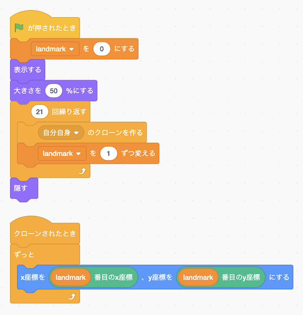

## サポートのお願い

Handpose2Scratchは2020年よりオープンソースかつ無料で提供しており、学校や各種プログラミング教室はじめさまざまな場所で利用されております。継続して開発を続けるためには、使っていただいている皆さまからの支援が必要です。<br />
[一杯のコーヒー](https://www.buymeacoffee.com/champierre)という形でサポートをいただけると大変ありがたく思います。

<a href="https://www.buymeacoffee.com/champierre"></a>


# Handpose2Scratch

Hand tracking on Scratch 3 with Webcam only.

It uses handpose package provided by MediaPipe and TensorFlow.js. If you want to know about the technology behind, please refer to "[Face and hand tracking in the browser with MediaPipe and TensorFlow.js](https://blog.tensorflow.org/2020/03/face-and-hand-tracking-in-browser-with-mediapipe-and-tensorflowjs.html)"

## Demo Movie

  

## How to use

- Open https://champierre.github.io/handpose2scratch on Chrome browser.
- Open Handpose2Scratch extension.

## Sample project

https://github.com/champierre/handpose2scratch/raw/master/sample_projects/handpose.sb3

### Japanese



### English


## Licence

- Handpose2Scratch is under [BSD 3-Clause License](./LICENSE.md), open source and freely available to anyone. You can use it at your classes, workshops. Commercial usage is also accepted. If you or your students created something cool using Handpose2Scratch, please share it on SNS using hashtag #handpose2scratch or let me know to any of these contacts. Interesting projects will be added to the "Examples of use".

## Examples of use

- https://www.youtube.com/watch?v=jxgwA770qOQ

## Requirements

- OS
  - Windows 8 (TBD)
  - Windows 10 (TBD)
  - MacOS
  - iOS
- Browser
  - Chrome
  - Safari(iOS)

Handpose2Scratch sometimes does not work because of some Chrome extensions. Please switch to [Guest Mode](https://support.google.com/chrome/answer/6130773) in such cases.

## For Developers - How to run Handpose2Scratch extension on your computer

1. Setup LLK/scratch-gui on your computer.

  ```
  % git clone git@github.com:LLK/scratch-gui.git
  % cd scratch-gui
  % npm install
  ```

2. In scratch-gui folder, clone Handose2Scratch. You will have handpose2scratch folder under scratch-gui.

  ```
  % git clone git@github.com:champierre/handpose2scratch.git
  ```

3. Run the install script.

  ```
  % sh handpose2scratch/install.sh
  ```

4. Run Scratch, then go to http://localhost:8601/.

  ```
  % npm start
  ```
